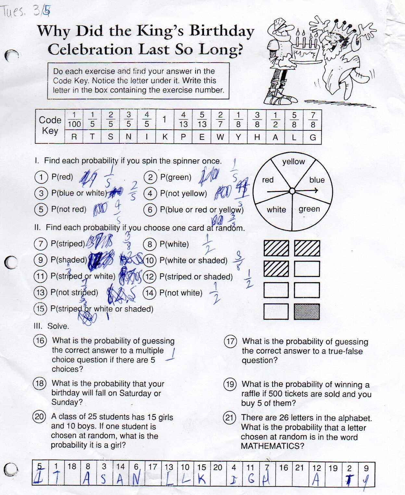
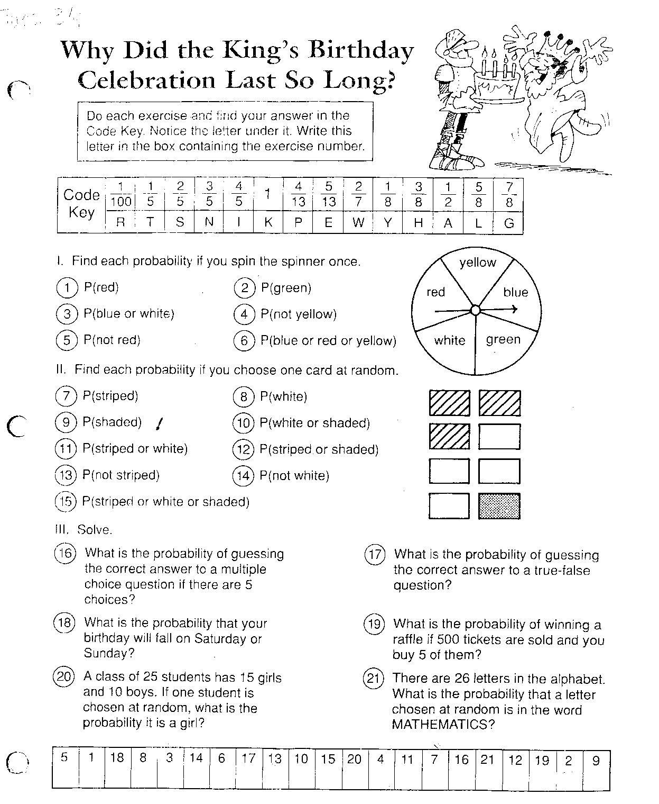

# Blue Ink Remover

A Python-based image processing tool for automatically removing blue ink from scanned worksheets and documents, while preserving the original printed black text.

## Purpose

This tool was designed to clean up scanned worksheets that have been completed with blue ink, making it easy to:

- Create clean copies of worksheets for distribution
- Reuse original worksheets by removing previous answers
- Create answer keys by removing student responses
- Improve document readability and clarity for archiving

## Results Comparison

Below is a side-by-side comparison showing the effectiveness of the blue ink removal process:

<table>
  <tr>
    <th>Original Scan (with blue ink)</th>
    <th>Processed Result (blue ink removed)</th>
  </tr>
  <tr>
    <td></td>
    <td></td>
  </tr>
</table>

As demonstrated in these images, the program effectively removes blue handwritten annotations while maintaining the quality of the original printed content.

## Requirements

- Python 3.9+
- OpenCV (cv2)
- NumPy
- Matplotlib (for visualization if needed)

You can install the required packages using:

```bash
pip install opencv-python numpy matplotlib
```

## How to Run

1. Place your scanned worksheet images in a directory (e.g., `docs/`)
2. Update the image paths in the script:
   - `image_path`: Path to your input image with blue ink
   - `output_path`: Where you want to save the cleaned image
3. Run the script:

```bash
python clean.py
```

Or if using a Jupyter notebook:

```bash
jupyter notebook clean.ipynb
```

## How It Works

The program processes images in several carefully engineered stages:

### 1. Image Loading and Preparation
```python
import cv2
import numpy as np
import matplotlib.pyplot as plt

# Load the image
image_path = "docs/scan.jpeg"  # Replace with your image path
output_path = "docs/output_cleaned.jpg"  # Replace with desired output path
image = cv2.imread(image_path)
```
This section loads the required libraries and reads the input image.

### 2. Blue Ink Detection and Masking
```python
# Convert to HSV color space for better blue detection
hsv_image = cv2.cvtColor(image, cv2.COLOR_BGR2HSV)

# Define range for blue color (adjust these values based on your image)
lower_blue = np.array([100, 50, 50])  # Lower bound for blue in HSV
upper_blue = np.array([130, 255, 255])  # Upper bound for blue in HSV
blue_mask = cv2.inRange(hsv_image, lower_blue, upper_blue)

# Invert the blue mask to use it for removing blue ink
blue_mask_inv = cv2.bitwise_not(blue_mask)
```
This stage detects blue ink by:
- Converting the image to HSV color space (better for color detection than RGB)
- Creating a mask for blue pixels using color thresholds
- Inverting the mask to identify non-blue areas

### 3. Black Text Detection
```python
# Create a mask for black content (low intensity in all channels)
gray_image = cv2.cvtColor(image, cv2.COLOR_BGR2GRAY)
black_mask = cv2.threshold(gray_image, 110, 255, cv2.THRESH_BINARY_INV)[1]  # Adjust threshold (110) as needed
```
This stage identifies the black printed text by:
- Converting the image to grayscale
- Using thresholding to separate dark text from the background

### 4. Combining Masks and Creating Clean Image
```python
# Combine masks to keep black content and remove blue ink
combined_mask = cv2.bitwise_and(black_mask, blue_mask_inv)

# Apply the mask to the original image to retain only black content
clean_image = cv2.bitwise_and(image, image, mask=combined_mask)
```
This crucial step:
- Combines the inverted blue mask with the black text mask
- Creates a mask that includes only black text (no blue ink)
- Applies this mask to preserve only the desired content

### 5. Image Enhancement and Cleanup
```python
# Convert to grayscale for enhancement
clean_gray = cv2.cvtColor(clean_image, cv2.COLOR_BGR2GRAY)

# Enhance contrast using CLAHE
clahe = cv2.createCLAHE(clipLimit=2.0, tileGridSize=(8, 8))
enhanced = clahe.apply(clean_gray)

# Denoise the image
denoised = cv2.fastNlMeansDenoising(enhanced, None, 10, 7, 21)

# Apply binary thresholding to get black text on white background
_, binary = cv2.threshold(denoised, 200, 255, cv2.THRESH_BINARY)

# Apply morphological operations with an adjustable kernel
kernel_size = 51  # Start here, can increase up to 51 or 101
kernel = np.ones((kernel_size, kernel_size), np.uint8)
cleaned = cv2.morphologyEx(binary, cv2.MORPH_CLOSE, kernel, iterations=1)
cleaned = cv2.morphologyEx(cleaned, cv2.MORPH_OPEN, kernel, iterations=1)
```
This enhancement stage:
- Improves contrast using CLAHE (Contrast Limited Adaptive Histogram Equalization)
- Reduces noise with non-local means denoising
- Binarizes the image to create clear black text on white background
- Uses morphological operations to fill gaps and remove small artifacts

### 6. Creating Final Output
```python
# Create the final output image (white background with black text)
output_image = np.ones_like(image) * 255
output_image[combined_mask > 0] = 0  # Set black regions
output_image = cv2.cvtColor(output_image, cv2.COLOR_BGR2GRAY)  # Convert to grayscale for simplicity
```
This stage:
- Creates a clean white background
- Adds the black text from the combined mask
- Converts to grayscale for the final output

### 7. Saving the Result
```python
# Save the result
cv2.imwrite(output_path, output_image)
print(f"Image saved to {output_path}")
```
This final step saves the cleaned image to the specified output path.

## Tuning and Modification

You can tune the following parameters to optimize for different scanned documents:

### Blue Color Detection
```python
lower_blue = np.array([100, 50, 50])  # Lower bound for blue in HSV
upper_blue = np.array([130, 255, 255])  # Upper bound for blue in HSV
```
- Adjust these values to match the specific shade of blue ink in your document
- For lighter blues, decrease the first value (100)
- For darker blues, increase the first value (130)
- To detect a wider range of blues, widen the gap between lower and upper bounds

### Black Text Detection
```python
black_mask = cv2.threshold(gray_image, 110, 255, cv2.THRESH_BINARY_INV)[1]
```
- Adjust the threshold value (110) based on the darkness of the printed text
- Lower values (e.g., 90) will detect lighter text but may include more noise
- Higher values (e.g., 130) will detect only darker text but might miss some content

### Morphological Operations
```python
kernel_size = 51  # Size of the kernel for morphological operations
```
- Adjust this value to control how aggressively the algorithm cleans the image
- Smaller values (e.g., 21) will preserve more detail but might leave small artifacts
- Larger values (e.g., 101) will create cleaner output but might remove fine details

### Contrast Enhancement
```python
clahe = cv2.createCLAHE(clipLimit=2.0, tileGridSize=(8, 8))
```
- Adjust the `clipLimit` to control contrast enhancement
- Higher values increase contrast but might amplify noise

### Denoising
```python
denoised = cv2.fastNlMeansDenoising(enhanced, None, 10, 7, 21)
```
- The first parameter (10) controls the filter strength
- Higher values provide more smoothing but might blur text edges

## Limitations and Boundary Conditions

This tool may not work effectively for all documents and may require fine-tuning depending on specific conditions. Below are some boundary conditions and limitations to consider:

**Varied Blue Shades:** The tool relies on HSV color ranges (default: 100-130 hue) to detect blue ink. If the blue ink varies significantly in shade (e.g., light blue pens or faded ink), the default range may miss some annotations. Fine-tuning the lower_blue and upper_blue values is necessary.

**Low Contrast Documents:** If the original black text has low contrast with the background (e.g., faded prints or colored paper), the black mask threshold (default: 110) may fail to distinguish text, requiring adjustment or manual intervention.

**Complex Backgrounds:** Documents with patterned or non-white backgrounds may confuse the thresholding and masking stages, leading to incomplete blue ink removal or text loss. Preprocessing to normalize the background or adjusting the black mask threshold can help.

**High Noise Levels:** Scanned images with significant noise (e.g., from poor scanning quality) may require stronger denoising (e.g., increasing the first parameter in fastNlMeansDenoising to 15-20) or larger kernel sizes, though this risks blurring fine details.

**Overlapping Colors:** If blue ink overlaps with black text or other colors, the tool may inadvertently remove parts of the black content. Careful tuning of the blue mask and black mask thresholds, or manual editing, may be needed.

**Large Document Size:** For very high-resolution scans, the default tileGridSize=(8, 8) in CLAHE or a 51x51 kernel may be insufficient or overly aggressive. Scaling these parameters proportionally to the image size is recommended.

To address these limitations, test the tool on a sample document and adjust the parameters in the "Tuning and Modification" section as needed. For complex cases, consider preprocessing the image (e.g., background removal) or using additional image processing techniques.

## Extending the Tool

You can extend this tool to handle other ink colors by:

1. Creating additional color masks (e.g., for red or green ink)
2. Adjusting the HSV color ranges for different colors:
   - Red: H ≈ 0-10 or 160-180
   - Green: H ≈ 40-80
   - Blue: H ≈ 100-130

## Troubleshooting

If your results aren't optimal, try these adjustments:

- **Problem**: Too much blue ink remains
  - Solution: Widen the blue color range or adjust the HSV values

- **Problem**: Black text is being removed
  - Solution: Lower the threshold value for black text detection

- **Problem**: Output is too noisy
  - Solution: Increase denoising strength or kernel size for morphological operations

- **Problem**: Fine details are lost
  - Solution: Decrease kernel size for morphological operations

## Author

Ravishankar Sivasubramaniam

## Contributing

Contributions to improve Blue Ink Remover are welcome. Here's how you can contribute:

1. Fork the repository
2. Create a feature branch (`git checkout -b feature/amazing-feature`)
3. Commit your changes (`git commit -m 'Add some amazing feature'`)
4. Push to the branch (`git push origin feature/amazing-feature`)
5. Open a Pull Request

Please make sure to update tests as appropriate and adhere to the existing coding style.

## License

This project is licensed under the MIT License - see below for details:

```
MIT License

Copyright (c) 2025 Ravishankar Sivasubramaniam

Permission is hereby granted, free of charge, to any person obtaining a copy
of this software and associated documentation files (the "Software"), to deal
in the Software without restriction, including without limitation the rights
to use, copy, modify, merge, publish, distribute, sublicense, and/or sell
copies of the Software, and to permit persons to whom the Software is
furnished to do so, subject to the following conditions:

The above copyright notice and this permission notice shall be included in all
copies or substantial portions of the Software.

THE SOFTWARE IS PROVIDED "AS IS", WITHOUT WARRANTY OF ANY KIND, EXPRESS OR
IMPLIED, INCLUDING BUT NOT LIMITED TO THE WARRANTIES OF MERCHANTABILITY,
FITNESS FOR A PARTICULAR PURPOSE AND NONINFRINGEMENT. IN NO EVENT SHALL THE
AUTHORS OR COPYRIGHT HOLDERS BE LIABLE FOR ANY CLAIM, DAMAGES OR OTHER
LIABILITY, WHETHER IN AN ACTION OF CONTRACT, TORT OR OTHERWISE, ARISING FROM,
OUT OF OR IN CONNECTION WITH THE SOFTWARE OR THE USE OR OTHER DEALINGS IN THE
SOFTWARE.
```
